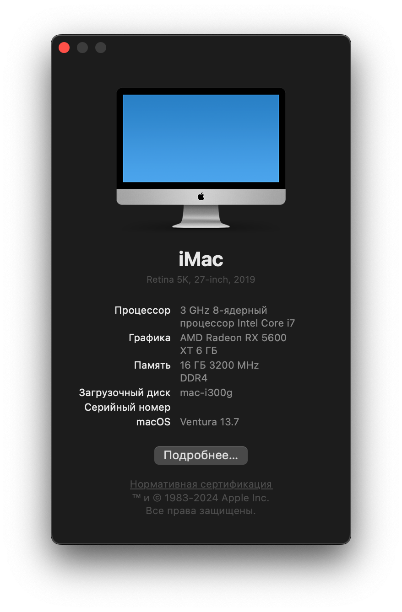
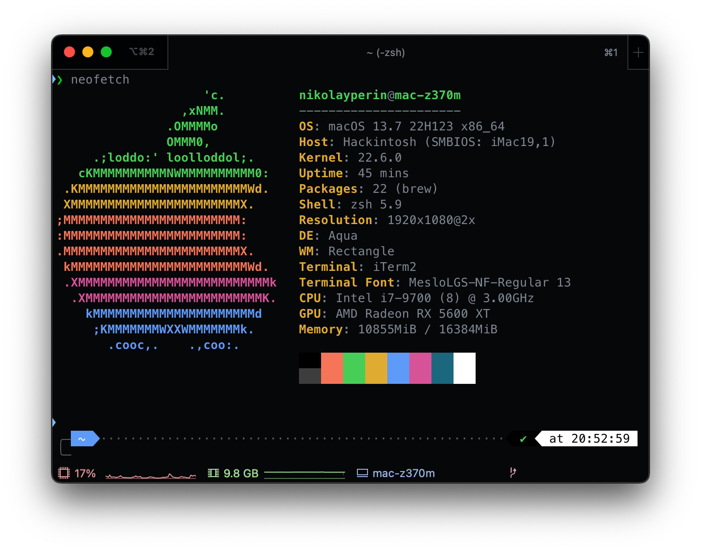

# Hackintosh Gigabyte ga-z370m-ds3h 

## Build
* **CPU:** Intel Core i7-9700
* **CPU Cooler:** Deepcool AG400
* **Motherboard:** Gigabyte GA-Z370M-DS3H
* **Audio:** ALC887
* **Network (LAN):** Realtek RTL8111
* **Network (WLAN):** Broadcom BCM943602CS
* **Memory:** Kingston HyperX KHX3200C16D4/16GX 16 GB DDR4-3200
* **Storage (MacOS/Windows):** XPG GAMMIX S11 Pro 512 GB M.2 NVME SSD
* **Storage (data):** TOSHIBA HDWD110 1 TB SATA HDD
* **Video Card:** ASUS DUAL RX 5600 XT T6G EVO
* **Power Supply:** MSI MAG A650BNL 80+ Bronze
* **Case:** HP Pavilion 500
* **Monitor:** Dell P2417H - 24" FHD LED
* **Keyboard:** SKYLOONG SK68
* **Mouse:** Logitech G603

### BIOS Settings (Version f14c) (https://www.gigabyte.ru/products/page/mb/z370m_ds3hrev_10/support#support-dl)
* M.I.T.
  * Advanced Frequency Settings
    Extreme Memory Profile (X.M.P.) - Profile1
* BIOS
  * Security Option → System
  * Fast Boot → Disabled
  * Windows 8/10 Features → Windows 8/10 WHQL
  * CSM Support → Disabled
  * Secure Boot
    * Secure Boot → Disabled
* Peripherials
  * CFG Lock → Disabled
  * Initial Display Output → PCIe 1 Slot
  * Above 4G Decoding → Enabled
  * Re-Size BAR Support → Auto
  * RGB Fusion (Onboard LED) → Off
  * Intel Platform Trust Technology (PTT) → Disabled
  * SW Guard Extensions (SGX) → Disabled
  * Trusted Computing
    * Security Device Support → Disable
  * Super IO Configuration
    * Serial Port → Disabled
    * Parallel Port → Disabled
  * USB configuration
    * Legacy USB Support → Enabled
    * XHCI Hand-off → Enabled
    * USB Mass Storage Driver Support → Enabled
    * Port 60/64 Emulation → Enabled
  * Network Stack Configuration
    * Network Stack → Disabled
  * SATA And RST Configuration
    * SATA Controller(s) → Enabled
    * SATA Mode Selection → AHCI
    * Aggressive LPM Support → Disabled
* Chipset
  * VT-d → Enabled
  * Internal Graphics → Enabled
  * DVMT Pre-Allocated → 64M
  * DVMT Total Gfx Mem → MAX (https://github.com/acidanthera/WhateverGreen/blob/master/Manual/FAQ.IntelHD.en.md#general-recommendations)
  * Audio Controller → Enabled
  * IOAPIC 24-119 Entries → Enabled
* Power
  * Platform Power Management → Disabled
  * AC BACK → Always Off
  * Power On By Keyboard → Disabled
  * Power On By Mouse → Disabled
  * ErP → Disabled
  * Soft-Off by PWR-BTTN → Instant-Off
  * Resume by Alarm → Disabled
  * Power Loading → Auto
  * CEC 2019 Ready → Disabled
  * RC6 (Render Standby) → Enabled

